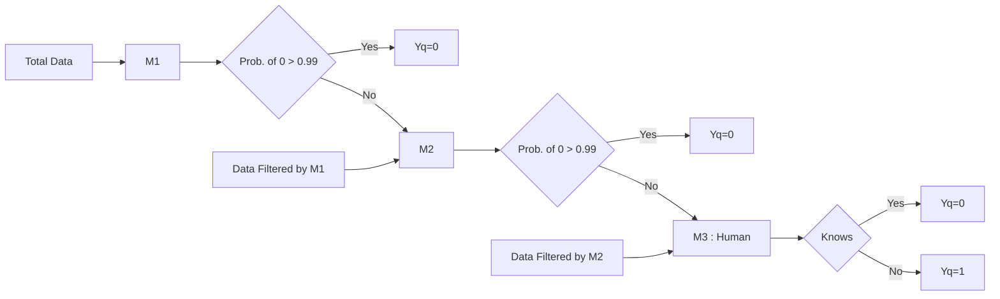

!!! tip
	- The more different the base models are the better we can combine them into an ensembels
	- $Model \ \  Error =  Bias^2 + Variance$

## Bootstrap Aggregation - Bagging 
- Bootstrap sample : Given a dataset  $D_n$ of n points, we sample with replacement  k datasets $\{D_m^i\}_k$ of m points each
- Aggregation : Then build k models $\{M_i\}_k$ using these $\{D_m^i\}$ (different subset of data) and get the Majority Vote / Mean is used for final aggregated prediction
- Bagging is commonly used to reduce variance of the model caused due to a noisy dataset without impacting the bias.  This happens because we are creating many samples of the data and the noise will never affect each data smaple 
- By creating many low-bias, high-variance models (overfit models for ex: High Depth Decision Trees) and then Aggregating them we can create a low-bias, reduced-variance model 

### Random Forrest
- Random Forrest  =  Bootstrap Sampling (Row Sampling with Replacement) + Feature Sampling (Column Sampling) + Decision Tress + Aggregation 
- **Out of bag error** is cross validation error on Out of bag points ($D_n - D_m^i$)
- **Hyperparametrs** : Row sampling rate, column sampling rate and no of base learners, Fix the the first two as resonable fraction and use CV to get the third 
- **Feature importance** is calculated as overall reduction in entropy because of feature at various levels of the base models 
- **Prune the dataset**: Using an extremely large dataset may prove to create results that is less indicative of the data provided than a smaller set that more accurately represents what is being focused on. Continue pruning the data at each node split rather than just in the original bagging process.
- **Decide on accuracy or speed**: Depending on the desired results, increasing or decreasing the number of trees within the forest can help. Increasing the number of trees generally provides more accurate results while decreasing the number of trees will provide quicker results.

### Extremely Randamised Trees 
- For any numerical feature it uses a random sample of values in that feature to calculate the threshold
- Extremely Randamised Trees have increased randomisation and hence more reduced variance

### Time Complexity
- Training complexity : $O(nlog(n)dk)$  Trivially parrallelizable as we can train multiple independed models
- Runtime complexity : $O(depth*k)$ 

## Boosting
!!! note "Algorithm"
	- Base learners : High Bias, Low variance ==> Large Training Error 
	- Step 0 : Train a model $M_0$ on $\{x_i, y_i\}_n$  to learn a function $F_0(x) = \alpha_0h_0(x)$ 
		- Calculate Residual Error  ${error_i}_0 = y_i - F_0(x_i)$
	- Step 1 : Train a model $M_1$ on $\{x_i, {error_i}_0\}_n$ to learn a function $F_1(x) = \alpha_0h_0(x) + \alpha_1h_1(x)$  
		- Calculate Residual Error ${error_i}_1 = y_i - F_1(x_i)$
	- Step 2 : Train a model $M_2$ on $\{x_i, {error_i}_1\}_n$ to learn a function $F_2(x) = \alpha_0h_0(x) + \alpha_1h_1(x) + \alpha_2h_2(x)$
	- At the end of Step k we get a model $F_k(x) = \sum_{j=0}^k \alpha_jh_j(x)$  with low training residual error i.e. low bias 

### Gradient Boosting Decision Tree  (GBDT)
!!! info "GBDT with MSE Loss"
	- Model @ end of Stage K : $F_k(x) = \sum_{j=0}^k \alpha_jh_j(x)$
	- Residuals @ end of Stage : K $err_i = y_i - F_k(x_i)$
	- Loss Functions : $L(y_i, F_k(x_i)) = (y_i - F_k(x_i))^2$
	- Negative Gradients : $-\frac{\partial{L}}{\partial{F_k(x_i)}} = 2(y_i - F_k(x_i))$
	- Optimisation Problem : $\alpha_k= argmin_\gamma \sum_{i=1}^n L(y_i, F_{k-1}(x_i) + \gamma h_k(x_i))$
	- $y_i, \ \ F_{k-1}(x_i) , \ \ h_k(x_i)$  are already known so above optimisation problem is very easy
	- Pseudo Residual : Negative Gradients is proportional to Residuals and is used in place of the actual residual
- GBDT is very easily overfit, As the number of base models (M) increase the bias decreases but there is a change that variance might increase. 
- Shrinkage/ Learning rate : $\nu$ weight for each $\alpha_jh_j(x)$ term in the final model (aside from M) is used to control the Overfitting 
- Scikit learn Implemntation is slow and not optimised : GradientBoostingClassifier = GBDT + Row Sampling 
- XGBoost :  GBDT + Row Sampling + Column Sampling By Tree (during creating the tree) + Column Sampling By Level (during computation of node split) + reg_alpha (L1 reguraliser) + reg_lambda (L2 reguraliser)
- XGBoost Implemntation is better optimised and is faster than scikit learn and can also be used under the scikit learn environment
	
### Adaptive Boosting (AdaBoost) 
- Weight on incorrectly classified points are increased exponentially - [Reference](https://alliance.seas.upenn.edu/~cis520/wiki/index.php?n=lectures.boosting)
- Used most successfully in computer vision application 

### Time Complexity
- Training  : $O(nlog(n)d*M)$, Since it is a step by step series model it is not easy to parallelise 
- Runtime :  $O(depth*M)$ , Can be used in lowlatency application
- GBDT generally takes more time to train than Random Forest but in runtime both are almost same in latency

## Stacking

Stacking combines multiple classification models via a meta-classifier. The individual classification models are trained based on the complete training set; then, the meta-classifier is fitted based on the outputs `meta-features`  of the individual classification models in the ensemble. The meta-classifier can either be trained on the predicted class labels or probabilities from the ensemble

- The more different the base models are the better we can combine them with stacking
- [mlxtend](https://rasbt.github.io/mlxtend/) is used to implement stacking classifier 

## Cascading
- Cascading is a Sequence of models within if else conditions to decide on final prediction, Typically used when the cost of making a mistake is high 
- Example: Fraud Detection / Cancer Detection (False : 0, True: 1)  

### References

1. [Pseudo-residuals for log-loss and classification](https://stats.stackexchange.com/questions/219241/gradient-for-logistic-loss-function)  
2. [Mathematics for using pseudo-residuals](https://en.wikipedia.org/wiki/Gradient_boosting#Algorithm)
